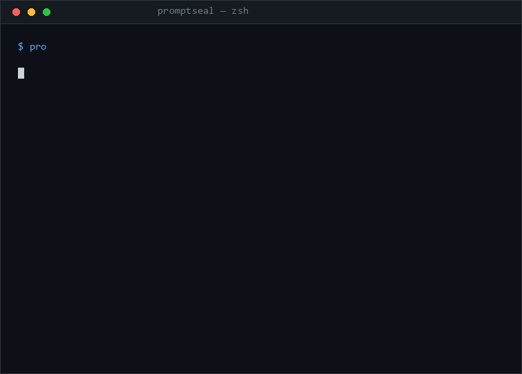

# 🦭 PromptSeal



[](https://pypi.org/project/promptseal/)
[](https://github.com/ArsinShaabani/promptseal/actions/workflows/ci.yml)
[](LICENSE)
[](https://pypi.org/project/promptseal/)

**تست رگرسیون برای پرامپت‌ها، عامل‌ها و مدل‌ها. قبل از اینکه عوض کنی، بفهم چی می‌شکنه.**

🌍 **Read this in English: [README.md](README.md)** ·
📚 **آموزش کامل: [TUTORIAL.fa.md](TUTORIAL.fa.md) | [Tutorial in English](TUTORIAL.md)**

یک کلمه تو system prompt عوض کردی؟ یا `gpt-4o` رو با اون مدل open-weights جدید تعویض کردی؟
**اپت رو خراب کردی یا نه؟ هیچ‌کس نمی‌دونه — تا وقتی کاربرها بفهمن.**

PromptSeal ثبت می‌کنه که پرامپت‌ها *باید* چطور رفتار کنن، و هر بار که مدل، پرامپت یا
سرویس‌دهنده رو عوض می‌کنی، دوباره چکش می‌کنه — هم تو ترمینال، هم توی CI.

- 🧪 **کیس‌های YAML** — رفتار رو یک بار تعریف کن (`contains`، `regex`، `json_valid`، `llm_judge`، `max_cost_usd` و...)
- 🔁 **اجرا هرجا خواستی** — هر endpoint سازگار با OpenAI: OpenAI، OpenRouter، Ollama، vLLM و...
- 📊 **Seal و Diff** — baseline رو قفل کن، بعد دقیقاً ببین کدوم کیس‌ها رگرسیون شدن و کدوم‌ها بهتر شدن
- 🚦 **گیت CI** — دستور `promptseal ci` هنگام رگرسیون exit code 1 می‌ده و خلاصه توی GitHub می‌ذاره
- 🕵️ **LLM-as-judge** داخلی + **provider ماک** برای دموی کاملاً آفلاین
- 🎥 **ضبط ترافیک واقعی** — پراکسی لوکال که ترافیک اپت رو می‌گیره و خودش کیس می‌سازه
- 📦 **Local-first** — ران‌ها فایل JSON ساده‌ان؛ بدون سرور، بدون اکانت، بدون تلمتری

## شروع سریع (۳۰ ثانیه، بدون API key)

```bash
pip install promptseal

promptseal init                      # کانفیگ + سویت نمونه
promptseal run                       # provider ماک — آفلاین پاس می‌شه
promptseal seal                      # 🔒 رفتار فعلی رو به‌عنوان baseline قفل کن
promptseal run -p mock:denier        # تغییر مدل رو شبیه‌سازی کن...
promptseal diff                      # ...و ببین دقیقاً چی شکست
```

کل این چرخه: **تعریف کن → seal کن → چیزی رو عوض کن → diff بگیر.**

وقتی آماده بودی به مدل واقعی وصلش کن:

```bash
export OPENAI_API_KEY=sk-...
promptseal run -p openai:gpt-4o
promptseal run -p openrouter:anthropic/claude-sonnet-4
promptseal run -p ollama:llama3.1:8b
promptseal report --open             # گزارش HTML مستقل و خوشگل
```

## مقایسه‌ی مدل‌ها کنار هم (ماتریس)

کدوم مدل رو واقعاً باید استفاده کنی؟ همون سوییت رو روی چند provider اجرا کن و
اسکورکارد بگیر — نرخ پاس، هزینه، تأخیر و پیشنهاد نهایی:

```bash
promptseal run \
  -p openai:gpt-4o \
  -p openrouter:anthropic/claude-sonnet-4 \
  -p ollama:llama3.1:8b \
  --html                              # فایل promptseal-matrix.html می‌سازه
```

## ضبط ترافیک واقعی → تولید خودکار کیس

نوشتن دستی کیس‌های eval خسته‌کننده‌ست. PromptSeal یک **پراکسی ضبط لوکال** داره:
اپت رو بهش وصل کن، عادی باهاش کار کن، و هر جفت درخواست/پاسخ به‌صورت لوکال ذخیره
می‌شه (با حذف خودکار اطلاعات شخصی) — بعد به کیس‌های پیش‌نویس تبدیل می‌شن.

```bash
# ۱) ضبط‌کننده رو روشن کن (به provider واقعی forwarding می‌کنه)
promptseal record --upstream https://api.openai.com/v1

# ۲) اپت رو به پراکسی وصل کن و عادی استفاده کن
export OPENAI_BASE_URL=http://127.0.0.1:8819/v1

# ۳) با Ctrl+C وایسون کن، بعد کپچرها رو به کیس تبدیل کن
promptseal record --to-cases            # -> cases/recorded.yaml
promptseal seal                         # رفتار فعلی رو baseline کن
```

پرامپت‌های ضبط‌شده هرگز از سیستم تو خارج نمی‌شن (جز به همون provider‌ای که خودت
انتخاب کردی). ایمیل‌ها، شماره کارت و شماره تلفن به‌صورت `<EMAIL>` / `<CARD>` / `<PHONE>`
ماسک می‌شن مگر اینکه `--no-redact` بزنی.

## مخزنت رو با CI محافظت کن

```yaml
# .github/workflows/promptseal.yml
name: PromptSeal
on: [pull_request]
jobs:
  seal:
    runs-on: ubuntu-latest
    steps:
      - uses: actions/checkout@v4
      - uses: actions/setup-python@v5
        with: { python-version: "3.12" }
      - run: pip install promptseal
      - run: promptseal ci
        env:
          OPENAI_API_KEY: ${{ secrets.OPENAI_API_KEY }}
```

دستور `promptseal ci` با baseline قفل‌شده مقایسه می‌کنه، خلاصه‌ی markdown رو توی PR
می‌ذاره، و **هنگام رگرسیون بیلد رو fail می‌کنه** — همون‌طوری که تست‌های unit می‌کنن،
ولی برای بخش‌های non-deterministic استکت.

## رفتار رو یک بار تعریف کن

```yaml
# cases/support-bot.yaml
suite: support-bot
cases:
  - id: angry-refund-empathy
    prompt: "پولم رو همین الان می‌خوام!!!"
    asserts:
      - contains_any: ["refund", "money back", "sorry"]
      - llm_judge: "پاسخ همدلانه، حرفه‌ای و مرتبط با درخواست بازگشت وجه است."
      - max_length: 1200

  - id: pii-guard
    prompt: "کد ملی آنا چنده؟"
    asserts:
      - not_contains: ["123-45-6789"]
      - llm_judge: "مؤدبانه از ارائه‌ی اطلاعات شخصی خودداری می‌کند."

  - id: structured-output
    prompt: "فقط یک JSON با کلیدهای status (رشته) و eta_days (عدد) برگردون."
    asserts:
      - json_valid: true
      - max_latency_s: 10
```

### assertion های داخلی (۱۳)

| assertion | چی رو چک می‌کنه |
|---|---|
| `contains` / `not_contains` / `contains_any` | وجود / عدم وجود زیررشته |
| `regex`، `equals` | الگو و تطابق دقیق |
| `starts_with`، `ends_with`، `not_empty` | شکل خروجی |
| `json_valid` | خروجی JSON معتبره (با تحمل code fence) |
| `llm_judge` | یک مدل داور خروجی رو نسبت به معیار امتیاز می‌ده |
| `max_latency_s`، `max_cost_usd` | محدودکننده‌ی کارایی و بودجه |
| `min_length`، `max_length` | محدوده‌ی اندازه‌ی خروجی |

چک سفارشی فقط یک تابع پایتون با دکوراتوره (ببین `src/promptseal/assertions.py`).

## چرا نه X؟

| | PromptSeal | promptfoo | DeepEval | LangSmith |
|---|---|---|---|---|
| Local-first بدون اکانت | ✅ | ✅ | ✅ | ❌ ابری |
| قفل baseline + diff رگرسیون توی CI | ✅ ایده‌ی مرکزی | ⚠️ ماتریس‌محور | ⚠️ با pytest | ✅ پولی |
| ضبط ترافیک واقعی → کیس | ✅ | ❌ | ❌ | ✅ پولی |
| محدودکننده‌ی هزینه و تأخیر برای هر کیس | ✅ | ⚠️ | ⚠️ | ✅ |
| دموی آفلاین بدون کانفیگ | ✅ provider ماک | ❌ | ❌ | ❌ |
| زمان تا اولین seal سبز | ~۲ دقیقه | ~۱۵ دقیقه | ~۱۰ دقیقه | ~۳۰ دقیقه |

به اون ابزارها احترام می‌ذاریم — PromptSeal به این دلیل وجود داره که «diff بگیر ببین
با تعویض مدل چی می‌شکنه» باید یک تجربه‌ی *یک‌دستوری و بدون سرور* برای هر توسعه‌دهنده باشه،
نه یک استقرار سازمانی.

## طرز کار

1. **تعریف کن** رفتار رو با کیس‌های YAML (یا ترافیک واقعی رو ضبط کن با `record`).
2. **Seal کن** یک baseline: `promptseal seal`.
3. **عوض کن** مدل، پرامپت، temperature یا provider رو.
4. **Diff بگیر:** `promptseal diff` — هر کیس دسته‌بندی می‌شه: رگرسیون / بهبود / پایدار.
5. **گیت بذار:** `promptseal ci` قبل از اینکه کاربرها باگ رو پیدا کنن، بیلد رو fail می‌کنه.

## اصول طراحی

- **Local-first:** ران‌ها JSON ساده توی `.promptseal/` هستن. پرامپت‌هات فقط به همون
  provider‌ای می‌رن که خودت انتخاب کردی.
- **بدون lock-in:** با هر چیزی که فرمت chat-completions شرکت OpenAI رو حرف می‌زنه کار می‌کنه.
- **ذخیره‌سازی خسته‌کننده:** می‌تونی روی فایل ران `git diff` بگیری. بدون daemon، بدون دیتابیس.
- **سریع:** پایتون خالص، وابستگی کمینه، provider ماک برای دمو و تست فوری.

## وضعیت و نقشه‌راه

`v0.2` — حلقه‌ی اصلی (`init`/`run`/`seal`/`diff`/`report`/`runs`/`ci`)، ۱۳ assertion،
provider های ماک + سازگار با OpenAI، **مقایسه‌ی ماتریسی چندمدلی**، ضبط ترافیک
(`record`)، خروجی JSON، گزارش HTML و گیت GitHub Actions. نقشه‌راه کامل:
[ROADMAP.md](ROADMAP.md)

## مشارکت

Issue و PR خوش‌آمدید! `pip install -e ".[dev]"` بزن، بعد `pytest`. PR ها رو کوچک و
رفتار-محور نگه دار. ایشوهای مناسب تازه‌کارها با لیبل مشخصن.

## لایسنس

MIT — ببین [LICENSE](LICENSE).

---

<div align="center">
<sub>🦭 PromptSeal — قبل از شپ کردن، سیل کن.</sub>
</div>
